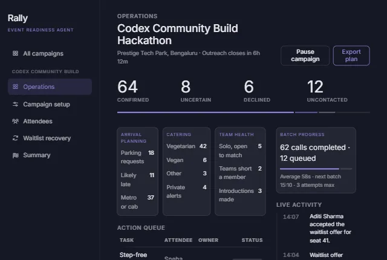

# Rally

> A voice-assisted event-readiness console that turns RSVP data into a clear operational plan.



## Why Rally

Event organisers rarely have a reliable view of who will actually attend, when they will arrive, or what support they need. Rally gathers those readiness signals, surfaces follow-ups, and helps teams recover seats when attendees decline.

## What it can do

- **Create campaigns** — capture event details, capacity, outreach questions, and phone-contact safeguards.
- **Import attendees** — support CSV/Excel, Google Sheets, Notion, HubSpot, Eventbrite, and manual-entry workflows in the UI.
- **Track readiness** — consolidate attendance, arrival, parking, food, team, and accessibility responses.
- **Run operations** — view confirmation counts, preference summaries, call activity, and an action queue.
- **Recover waitlist seats** — release declined seats only with consent, then create visible offers for waitlisted attendees.
- **Protect consent** — keep consent, opt-out, dietary, and accessibility workflows explicit in the product flow.

## Product flow

1. An organiser creates a campaign and imports an attendee list.
2. Rally collects readiness responses through the outreach workflow.
3. The operations view converts responses into catering, arrival, accessibility, and follow-up actions.
4. A decline can release a seat and trigger a waitlist offer with a defined expiry.

## Tech stack

| Area | Technology |
| --- | --- |
| Frontend | React, Vite, JavaScript |
| UI | Custom CSS, Lucide icons |
| Backend | Express, Prisma, PostgreSQL |
| Voice workflow | Sarvam scheduling and call-result endpoints |
| Deployment | Vercel backend: [rally-backend-six.vercel.app](https://rally-backend-six.vercel.app/) |

## Run locally

```bash
npm install
npm run dev
```

Create `.env.local` to use your local Express API:

```env
VITE_API_URL=http://localhost:4000/api
```

The committed `.env.example` points to the deployed backend. When no API URL is available, Rally falls back to mock campaign data so the UI can still be explored.

## Backend integration

The frontend composes the operations view from the backend’s focused endpoints instead of depending on one large dashboard payload:

```text
GET /api/campaigns
GET /api/campaigns/:campaignId
GET /api/campaigns/:campaignId/attendees
GET /api/campaigns/:campaignId/preferences-summary
GET /api/campaigns/:campaignId/tasks
GET /api/campaigns/:campaignId/waitlist
GET /api/campaigns/:campaignId/activity
```

The mapping layer lives in [`src/data/rallyApi.js`](src/data/rallyApi.js). It normalizes campaign records and turns backend attendee, preference, task, waitlist, and activity data into the view models used by the UI.

## Project structure

```text
src/
├── App.jsx              # Product screens and UI interactions
├── styles.css            # Responsive Rally design system and layouts
└── data/rallyApi.js      # API client, data normalization, and mock fallback
public/
└── rally-dashboard.png   # README UI preview
```

## Current status

The frontend is responsive and API-ready. The deployed backend health endpoint is available at [`/health`](https://rally-backend-six.vercel.app/health).
